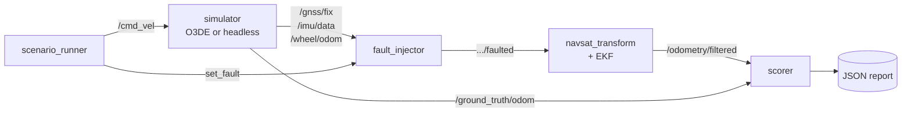

# Kraken Localisation Robustness Demo

**Does your robot still know where it is when the sensors lie to you?**

This project takes a localisation stack, deliberately breaks its sensors while
it drives, and measures how far the estimate drifts from ground truth. Every
failure mode is a file, every file is a test, and the whole suite runs headless
in Docker in a couple of minutes.

Its ancestor is [o3de/ROSConDemo][roscondemo], which is where the O3DE +
ROS 2 project layout and the `docker/` conventions come from. That demo asks
"can a robot do a job in a nice-looking world". This one asks a narrower and
grumpier question: **when the GNSS fix disappears mid-turn, does the filter
notice, and does it care?**

[roscondemo]: https://github.com/o3de/ROSConDemo

## The result

One EKF configuration, one extra fused measurement, same 40-second drive with
the GNSS fix killed at t=15s. Ten runs per profile, seeds 0-9:

| profile  | fuses                  | worst position error | worst heading error |
| -------- | ---------------------- | -------------------- | ------------------- |
| `naive`  | wheel speed + GNSS     | **21.8 ± 0.9 m**     | **179.9 ± 0.04°**   |
| `robust` | + IMU yaw rate         | **0.36 ± 0.25 m**    | **1.9 ± 1.2°**      |

Mean ± standard deviation over ten seeds. Reproduce with

    ros2 run kraken_scenarios sweep total_gnss_dropout -n 10

Do not quote a single run. The harness is not reproducible: the simulator steps
on a wall-clock timer while the filter, fault injector and scorer consume its
output over DDS, so the interleaving - and the result - moves from run to run.
The order of magnitude between the two profiles is the result; the second
decimal place is not.

Both look identical while the fix is healthy. That is the entire point: the bug
is invisible until the day it matters. The `naive` profile is kept, and kept
*failing*, as the control case.

## Quick start

Nothing to install but Docker.

```bash
git clone <your fork> kraken-demo && cd kraken-demo
docker compose -f docker/docker-compose.yml run --rm test
```

That builds the workspace and runs all ten scenarios. To poke at it by hand:

```bash
docker compose -f docker/docker-compose.yml run --rm stack
# inside:
ros2 launch kraken_scenarios scenario.launch.py scenario:=total_gnss_dropout
```

## How it works



The injector is a shim between the sensors and the filter. Nothing in the
simulator or the filter knows it exists, which is what lets the same scenarios
run against O3DE and against the headless model.

Errors are measured **relative to the pose at the moment the fault was
injected**. The map frame and the simulator's world frame never line up
exactly, and that constant offset is not a localisation error — cancelling it
is what makes the numbers mean something.

Two guards stop a broken run from passing quietly: a scenario must cover a
minimum path length and a minimum amount of rotation. A robot wedged against
a wall has beautiful localisation error, and without those checks the suite
would happily call it a pass.

## Scenarios

| file | fault | asserts |
| ---- | ----- | ------- |
| `total_gnss_dropout` | fix lost entirely | stays localised |
| `gnss_dropout_naive` | fix lost, no gyro fused | **diverges** (control case) |
| `gnss_degraded` | RTK → single point, 2 m noise | position bounded, heading recovers |
| `gnss_spoof` | fix walks off at 0.2 m/s, covariance still tight | **follows the spoof** (known gap) |
| `imu_dropout` | gyro dies, GNSS healthy | position bounded, heading lags then recovers |
| `wheel_slip` | encoders report 2× the real motion | stays localised |
| `terrain_dropout` | fix lost *and* the ground is slippery | **drifts 9.6 m** while heading stays under 3° |
| `nav_baseline` | none, one Nav2 goal 12.65 m out | arrives, and is really there |
| `nav_terrain_dropout` | the same goal, fix lost, ground slippery | **believes it arrived, is 5.3 m short** |
| `nav_terrain_dropout_radar` | the same again, with a ground-speed radar | arrives late, and is really there |

Thresholds live in the scenario files, each annotated with the distribution
actually measured over an eight-seed sweep. Add a failure mode by adding a YAML
file; no Python required. See [docs/faults.md](docs/faults.md) for what each
injector mode does and [docs/design.md](docs/design.md) for why it is built this
way.

Four scenarios assert *failure* on purpose. `gnss_spoof` documents a real gap —
the filter has no innovation gate, so a confident lie is a trusted lie. Better
to have it red and visible than assumed and absent.

`terrain_dropout` is the same run as `total_gnss_dropout` with one field
changed, and it is the interesting one. Every sensor is healthy and every
message is honest: the wheels really are turning at the commanded rate, the
encoders really do report that, and the robot simply does not get there. There
is no disagreement between sources for a filter to detect, so cross-checking
cannot help, and the error is 26× the flat case while the heading error stays
inside the bound the flat case passes. It also has a *tenth* the spread, because
dead reckoning over flat ground is a random walk while this is a systematic
bias.

`nav_terrain_dropout` is what that costs you. It gives Nav2 a goal 12.65 m away
over the same ground. Across eight seeds:

| | flat, healthy fix | slippery, no fix | slippery, **radar** |
| --- | --- | --- | --- |
| distance to goal, **believed** | 0.241 m | 0.239 m | 0.357 m |
| distance to goal, **true** | 0.292 m | **5.494 m** | **0.297 m** |
| ground actually covered | 12.61 m | 7.31 m | 12.55 m |
| time to goal | 22.7 s | 22.8 s | 63.7 s |
| Nav2 reported success | 8/8 | 8/8 | 8/8 |

(Measured on the headless kinematic sim, which scales commanded velocity by a
traction factor. The same stack drives the O3DE fruit picker, where the physics
is real; the mechanism carries over but these magnitudes will not.)

The robot's own account of the run is unchanged — same believed goal error, same
clean heading, same confident covariance — while it sits 5 m from where it was
sent. Nav2 judges arrival from the estimate, because the estimate is the only
thing it has, so a bias in the estimate moves the finish line with it and
cancels out of every number the robot can check. It reported SUCCEEDED in every
one of the eight runs.

This is why the suite scores against ground truth instead of against the filter,
and why the scenario asserts on *both* goal errors at once: the failure is not
that either number is bad, it is that they disagree.

The third column is the fix. A Doppler ground-speed radar reads speed off the
ground rather than off the wheels, which is why agricultural machinery has
carried them for decades. It is the only sensor left that can see the quantity
the bias lives in once the fix is gone. With it, belief and truth agree again to
0.04 m. Note that it arrives in 93 s rather than 25: the ground is still
slippery and no sensor changes that, so arriving *late* is what success looks
like, and arriving on time is the lie.

Adding it alongside the wheels would not have worked. A filter blends by inverse
variance, so the wheels' claimed ±0.01 m/s outvotes the radar four to one; a
covariance is a claim about accuracy, and a slipping encoder's claim is false in
a way no extra evidence corrects. The lying measurement has to go, not be
outnumbered. See [docs/design.md](docs/design.md) for the arithmetic.

## Simulation

The scenarios run against a headless kinematic model (`kraken_sim`) that owns
`/clock` and runs at 3× wall speed, so the suite is fast and repeatable and
needs no GPU.

`Project/` holds the O3DE side. **It is a skeleton, not a finished level** —
the project registers and the ROS 2 Gem wiring is described, but the scene
itself has to be authored in the O3DE Editor. See
[Project/README.md](Project/README.md). Contributions very welcome; that is the
biggest open piece of this repo.

## Navigation

The same machine also has a day job. `kraken_nav` gives it complete coverage of
an orchard — every aisle driven, headland turns planned on closed-form geometry
rather than searched for, and no stop between one row and the next — implemented
as a Nav2 navigator plugin rather than as a script above the stack.

Full write-up, with the conventions, the math, the behaviour tree and the bugs
that only a real simulator finds: **[docs/navigation.md](docs/navigation.md)**.

## Repository layout

```
docker/                 Dockerfile.Stack (light, no GPU) and Dockerfile.Simulation (O3DE, GPU)
Project/                O3DE project skeleton
ros2_ws/src/
  kraken_interfaces/    FaultSpec, LocalisationScore, SetFault
  kraken_sim/           headless kinematic simulator, owns /clock
  kraken_faults/        the fault injector shim
  kraken_localisation/  EKF profiles (naive / robust / radar) + navsat_transform
  kraken_scenarios/     scenario files, scorer, runner, launch tests
```

## Contributing

Good first issues: a new fault mode, a new scenario, an innovation gate that
catches `gnss_spoof`, or an O3DE level. See [CONTRIBUTING.md](CONTRIBUTING.md).

## License

BSD-3-Clause. See [LICENSE](LICENSE).
