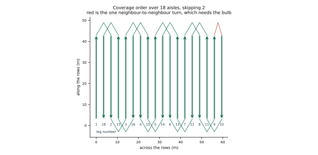

# Kraken orchard navigation

Two questions, one robot.

**Does your robot still know where it is when the sensors lie to you?** That is
the [localisation robustness suite](https://github.com/rotesfahrrad/kraken-demo):
break the sensors mid-drive, measure the drift, keep the failing configuration
as the control case.

**Can it do a day's work without being told where to point?** That is what these
pages are about. An Ackermann orchard robot is given a field — eighteen aisles,
3.5 m apart — and asked to drive every one of them and come back. It plans its
own headland turns on geometry, follows them on curvature, and never leaves the
boundary it was given.

## Read this

- **[Navigation](navigation.md)** — the whole system. Conventions, kinematics,
  the turn ladder, the controller, the behaviour tree, the geofence, results,
  and the five bugs that only a real simulator finds.
- [Design notes](design.md) — why the fault shim sits outside the simulator, and
  why there is a headless model at all.
- [Fault modes](faults.md) — what each injected fault does to which channel.

## The short version

| | |
| --- | --- |
| Field | 18 aisles, 3.5 m pitch, 44 m rows |
| Machine | Ackermann, 2.2 m wheelbase, 0.7 rad lock, 3.1 m long |
| Tightest circle | 2.61 m radius — wider than one aisle, so turns skip |
| Coverage | every aisle, one geometric headland turn between each |
| Best measured | 4/4 aisles, 0.02–0.11 m off the planned path |
| Stops between rows | none — the turn is appended to the path being followed |

