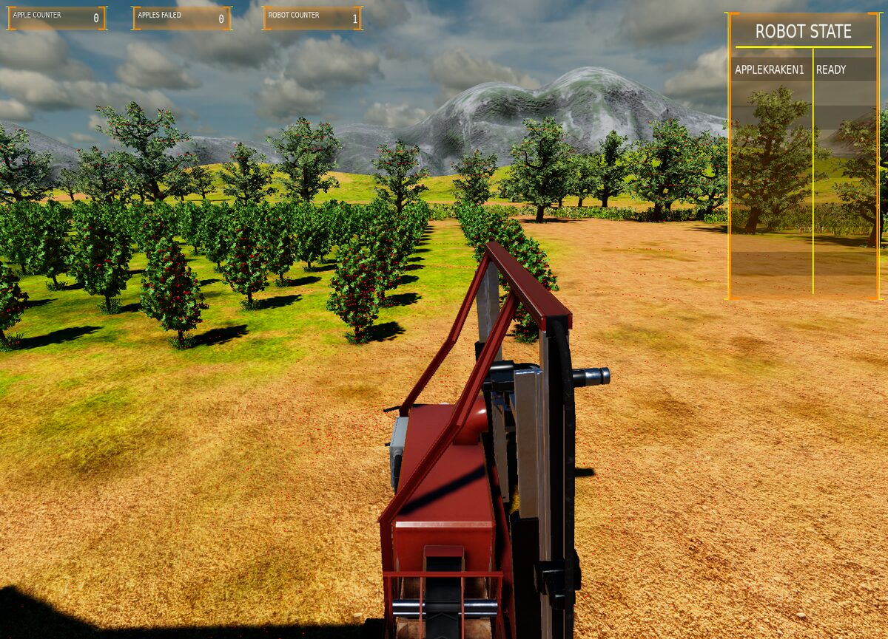
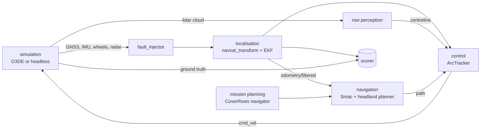
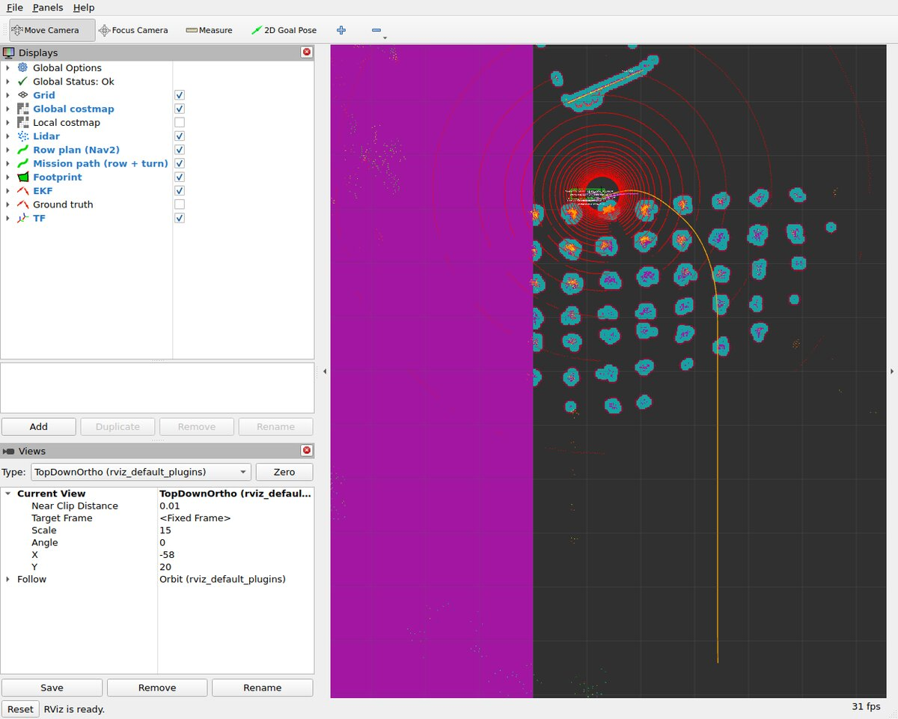

# Kraken autonomy stack

An autonomy stack for an Ackermann orchard robot, and the harness that measures
it. Two questions, one robot.

**Does it still know where it is when the sensors lie to you?** Break the
sensors mid-drive, score the estimate against ground truth, and keep the failing
configuration as the control case.

**Can it do a day's work without being told where to point?** Eighteen aisles,
3.5 m apart: drive every one of them and come back. It plans its own headland
turns on geometry, follows them on curvature, and never leaves the boundary it
was given.

**[Start here →](getting-started.md)** — nothing to install but Docker, and the
whole suite runs in a couple of minutes.


*The machine at the edge of the field in O3DE, aisles running away to the left.*

## The subsystems

| Page | What it owns |
| --- | --- |
| **[Simulation environment](simulation.md)** | The headless kinematic model that owns `/clock`, the O3DE scene, and which one is real about what |
| **[Localisation](localisation.md)** | EKF profiles, what is fused and why, the fault shim, the robustness suite and how a run is scored |
| **[Row perception](perception.md)** | Turning a lidar cloud into the corridor the machine is standing in |
| **[Navigation](navigation.md)** | Field layout, the skip rule, headland turn geometry, refusing a turn that will not sweep, the geofence |
| **[Control](control.md)** | Reading arcs out of a path, the curvature trim law, speed limits, refusing to drive |
| **[Mission planning](mission-planning.md)** | The `CoverRows` action, the navigator plugin, the behaviour tree, why the machine never stops between rows |

And three references that cut across all of them:

- **[Getting started](getting-started.md)** — prerequisites, the suite, a single
  scenario, the coverage run, the tests.
- **[Fault modes](faults.md)** — what each injected fault does to which channel,
  and how to add one.
- **[Design notes](design.md)** — why the shim sits outside the simulator, why
  there is a headless model at all, why terrain is the exception, why the goal
  error is scored twice, and the known gaps.

## How it fits together



The arrow that matters is the one that is **missing**: nothing feeds ground
truth back into the robot. Nav2 judges arrival from the filter's estimate,
because the estimate is all it has, which is why a biased estimate moves the
finish line with it and cancels out of every number the robot can check about
itself. The scorer sits outside the robot for exactly that reason.

## The short version

| | |
| --- | --- |
| Field | 18 aisles, 3.5 m pitch, 44 m rows |
| Machine | Ackermann, 2.2 m wheelbase, 0.7 rad lock, 3.1 m long |
| Tightest circle | 2.61 m radius — wider than one aisle, so turns skip |
| Coverage | every aisle, one geometric headland turn between each |
| Best measured | 4/4 aisles, 0.02–0.11 m off the planned path |
| Stops between rows | none — the turn is appended to the path being followed |
| Localisation, GNSS lost | 0.36 ± 0.25 m with the gyro fused, 21.8 ± 0.9 m without |
| Suite | 10 scenarios, headless, no GPU, about two minutes |


*Mid-mission. The machine has turned in off the headland and is running the
aisle; the yellow line is the row and its next turn as one path, the cyan
clusters are lidar returns off the trunks, and the magenta block on the left is
the keepout mask that stops it leaving the field.*


## Repository layout

```
docker/                 stack (no GPU), simulation (O3DE, GPU) and viz images, plus the
                        scripts that graft the localisation sensors onto the ROSConDemo Kraken
docs/                   these pages
patches/                patches applied to the O3DE engine and gems at image build time
Project/                O3DE project skeleton
ros2_ws/src/
  kraken_interfaces/    FaultSpec, LocalisationScore, RowEstimate, SetFault, CoverRows
  kraken_sim/           headless kinematic simulator, owns /clock, models terrain traction
  kraken_faults/        the fault injector shim between the sensors and the filter
  kraken_localisation/  EKF profiles (naive / robust / radar) + navsat_transform
  kraken_scenarios/     scenario files, scorer, runner, sweep, launch tests
  kraken_nav/           Nav2 plugins: CoverRowsNavigator, HeadlandPlanner, ArcTracker,
                        BT nodes, nav2.yaml, keepout mask, launch files
  kraken_orchard/       row perception: fits the trunk lines either side from the lidar
                        cloud and publishes the corridor between them
```

Source: [github.com/eborghi10/kraken-demo](https://github.com/eborghi10/kraken-demo).
BSD-3-Clause.
