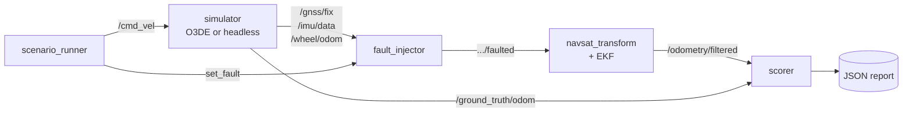

# Localisation

*[Docs index](index.md) · [Fault modes](faults.md) · [Design notes](design.md)*

**Does the robot still know where it is when the sensors lie to you?**

The stack is an ordinary one — `robot_localization`'s EKF with
`navsat_transform` in front of it — wired the real way, with nothing stubbed.
What is unusual is what sits beside it: a shim that breaks the sensors on cue,
and a scorer that grades the estimate against ground truth rather than against
itself.

---

## 1. The pipeline

The injector is a shim between the sensors and the filter. Nothing in the
simulator or the filter knows it exists, which is what lets the same scenarios
run against [O3DE and against the headless model](simulation.md).

`navsat_transform` projects the fix into the map frame and the EKF publishes
`map → odom`. The filter runs in 2D mode at 30 Hz.

---

## 2. The three profiles

`ros2 launch kraken_localisation localisation.launch.py profile:=robust`.
Everything else about the stack is identical between them, which is what makes
the comparison a measurement rather than a claim.

| profile | wheel forward speed | lateral constraint | GNSS | IMU yaw rate | ground-speed radar |
| --- | :-: | :-: | :-: | :-: | :-: |
| `naive` | ✓ | ✓ | ✓ | | |
| `robust` | ✓ | ✓ | ✓ | ✓ | |
| `radar` | | ✓ | ✓ | ✓ | ✓ |

**`naive` → `robust` is one measurement**, the yaw rate. Without it heading is
observable only through GNSS, so losing the fix leaves the estimate rotating at
whatever rate it last held. Absolute IMU yaw is deliberately *not* fused: plenty
of vehicles carry a gyro and no usable magnetometer, and assuming a heading
reference would hide the problem rather than solve it.

**`radar` removes one and adds one**, and the pairing is the point: under slip
the encoders are confidently wrong, and an EKF blends by inverse variance, so a
lying measurement has to be removed rather than outvoted. See
[design](design.md#why-the-radar-replaces-the-wheels-rather-than-joining-them).

The **lateral constraint** is in every profile. A differential-drive base cannot
translate sideways, but nothing in the filter knew that, and the estimate
happily ramped to 0.98 m/s of sideways motion on a robot whose true lateral
velocity is zero. It is a kinematic constraint rather than a sensor, so it
belongs in all three, and it stays true under slip because slip is forward.

The naive profile is kept, and asserted to *stay* broken, as the control case.

---

## 3. The result

One EKF configuration, one extra fused measurement, same 40-second drive with
the GNSS fix killed at t=15 s. Ten runs per profile, seeds 0–9:

| profile | fuses | worst position error | worst heading error |
| --- | --- | --- | --- |
| `naive` | wheel speed + GNSS | **21.8 ± 0.9 m** | **179.9 ± 0.04°** |
| `robust` | + IMU yaw rate | **0.36 ± 0.25 m** | **1.9 ± 1.2°** |

Both look identical while the fix is healthy. That is the entire point: the bug
is invisible until the day it matters.

---

## 4. The robustness suite

Ten scenario files, each a YAML description of a drive and the faults injected
during it. Adding a failure mode is adding a file; no Python required.

| file | fault | asserts |
| --- | --- | --- |
| `total_gnss_dropout` | fix lost entirely | stays localised |
| `gnss_dropout_naive` | fix lost, no gyro fused | **diverges** (control case) |
| `gnss_degraded` | RTK → single point, 2 m noise | position bounded, heading recovers |
| `gnss_spoof` | fix walks off at 0.2 m/s, covariance still tight | **follows the spoof** (known gap) |
| `imu_dropout` | gyro dies, GNSS healthy | position bounded, heading lags then recovers |
| `wheel_slip` | encoders report 2× the real motion | stays localised |
| `terrain_dropout` | fix lost *and* the ground is slippery | **drifts 9.6 m** while heading stays under 3° |
| `nav_baseline` | none, one Nav2 goal 12.65 m out | arrives, and is really there |
| `nav_terrain_dropout` | the same goal, fix lost, ground slippery | **believes it arrived, is 5.3 m short** |
| `nav_terrain_dropout_radar` | the same again, with a ground-speed radar | arrives late, and is really there |

Four assert *failure* on purpose. `gnss_spoof` documents a real gap — the filter
has no innovation gate, so a confident lie is a trusted lie. Better red and
visible than assumed and absent.

What each injector mode does to which channel is in
[fault modes](faults.md). Thresholds live in the scenario files, each annotated
with the distribution actually measured over a sweep.

---

## 5. How a run is scored

Four decisions do most of the work, and each is argued in
[design](design.md):

- **Errors are relative to the pose pair captured at the fault instant.** The
  map frame and the simulator's world frame never line up exactly, and that
  constant offset is not a localisation error.
- **Worst case *and* final value are bounded separately.** Losing a sensor
  mid-turn produces a transient the filter recovers from; for some faults that
  is acceptable and a permanent offset is not.
- **Two guards.** A scenario must cover a minimum path length and a minimum
  amount of rotation. A robot wedged against a wall has beautiful localisation
  error, and without those checks the suite would call it a pass.
- **Goal error is scored twice**, believed and true. Nav2 judges arrival from
  the estimate, because the estimate is all it has, so a bias in the estimate
  moves the finish line with it. The failure is not that either number is bad,
  it is that they disagree.

**Do not quote a single run.** The simulator steps on a wall-clock timer while
the filter, injector and scorer consume its output over DDS, so the interleaving
moves between runs. Use `ros2 run kraken_scenarios sweep <scenario> -n 10` and
read the order of magnitude.

---

## 6. Where localisation and navigation meet

`nav_terrain_dropout` is the scenario that joins the two halves of this repo.
Every sensor is healthy and every message is honest — the wheels really are
turning at the commanded rate, the encoders really do report that, the ground
simply declines to convert it into motion. There is no disagreement for a filter
to detect.

| | flat, healthy fix | slippery, no fix | slippery, **radar** |
| --- | --- | --- | --- |
| distance to goal, **believed** | 0.241 m | 0.239 m | 0.357 m |
| distance to goal, **true** | 0.292 m | **5.494 m** | **0.297 m** |
| ground actually covered | 12.61 m | 7.31 m | 12.55 m |
| time to goal | 22.7 s | 22.8 s | 63.7 s |
| Nav2 reported success | 8/8 | 8/8 | 8/8 |

The robot's own account of the run is unchanged while it sits 5 m from where it
was sent, and it reported SUCCEEDED in every run. The radar recovers it — and
takes 64 s instead of 23, because the ground really is slippery and no sensor
changes that. **Arriving late is what success looks like here; arriving on time
is the lie.**

---

## 7. Known gaps

- No innovation gating, so `gnss_spoof` is followed rather than rejected.
- Nothing detects the slip bias when the radar is absent, which is every profile
  but `radar`. The stack has no cross-check that would fire.
- Wheel speed minus radar speed is the slip ratio, a number a fruit picker could
  act on, and it is published nowhere.

The full list, with the reasoning behind each, is in
[design](design.md#known-gaps).
