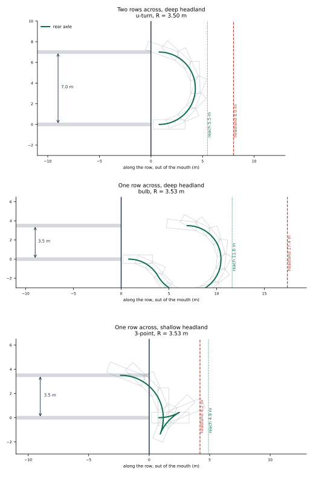

# Navigation

How an Ackermann orchard robot covers a field: what it assumes, what it
computes, what it refuses to do, and what broke on the way.

Everything below is implemented in `ros2_ws/src/kraken_nav`. Nothing here is
aspirational — where a number appears it was either measured off the level, read
off a run, or asserted in `test/test_headland.cpp`.

---

## 1. The job

An orchard is not a warehouse. The free space is a comb: long parallel aisles
with almost no lateral room, joined at each end by a strip of open ground called
the **headland**. The work happens *in* the aisles; the headland exists only so
the machine can get from one aisle to the next.

That geometry breaks the usual assumption of a navigation stack. Sending a goal
pose at the far end of a row and letting a search planner work it out is fine
for one row. It is not fine for a field, because:

- **The order matters.** The machine cannot turn into the neighbouring aisle, so
  "do them left to right" is not drivable.
- **The turn matters more than the row.** Driving 44 m down a corridor is easy.
  Reversing direction in 10 m of headland with a 2.6 m turning circle and a
  3.1 m body is the entire problem.
- **Stopping is a cost.** A machine that halts at the end of every row to think
  about the next one loses a large fraction of the day to standing still.

So the mission is a first-class part of the navigation stack rather than a
script sitting above it. Nav2's own documentation names this case explicitly:

> It may be beneficial to write your own Navigator if you have a custom action
> message definition you'd like to use with Navigation rather than the provided
> `NavigateToPose` or `NavigateThroughPoses` interfaces (**e.g. doing complete
> coverage**).
>
> — *Nav2, Writing a New Navigator Plugin*

---

## 2. Conventions

### Frames

| Frame | Meaning |
| --- | --- |
| `map` | The world. In this simulator the map frame and the world frame coincide, so prefab coordinates are map coordinates. |
| `<ns>/odom` | Smooth, drifting, continuous. The local costmap lives here. |
| `<ns>/base_link` | The **rear axle**, not the centre of the machine. |

Frames are namespaced per robot; `map` is shared. The launch file rewrites frame
names *by value* rather than by key, because `global_frame` means the odom frame
in the local costmap and the map frame in the global one.

### The footprint

Measured off the prefab's colliders:

```
footprint: [ [2.5, 0.45], [2.5, -0.45], [-0.6, -0.45], [-0.6, 0.45] ]
```

The box is **not symmetric about the origin**. `base_link` is the rear axle, so
the body runs 0.6 m behind it and 2.5 m ahead. This is the single most
load-bearing convention in the document: every clearance figure is a statement
about where the *front bumper* ends up, and the front bumper is 2.5 m from the
point the kinematics are written about.

- inscribed radius 0.45 m
- circumscribed radius 2.55 m
- overall 3.1 m long, 0.9 m wide

### The row frame

The mission does not think in map coordinates. It anchors a frame at wherever
the machine is standing when the goal arrives, oriented along the rows, and
describes the whole field in it. For a heading $\theta$ with
$c = \cos\theta$, $s = \sin\theta$, a map displacement $(dx, dy)$ resolves as

$$
\text{along} \;=\; c\,dx + s\,dy,
\qquad
\text{across} \;=\; -s\,dx + c\,dy .
$$

and the inverse, used to turn a row-frame target back into a goal pose:

$$
x \;=\; x_0 + c\,\text{along} - s\,\text{across},
\qquad
y \;=\; y_0 + s\,\text{along} + c\,\text{across}.
$$

**Sign convention:** positive `across` is to the machine's **left**. Positive
`along` is **forward**, i.e. into the row. A turn onto a row at
$\text{across} = +7$ is a left turn.

This is why the action takes `row_near_x`, `row_far_x` and `row_heading_deg`
rather than a list of poses: the field is described the way an orchard is laid
out — a count of aisles and their spacing — and pinned to the machine's actual
position at the moment of the goal.

### The field, as surveyed

Read directly from `Project/Levels/Main/Main.prefab`: eighteen `RowSpawnPoint`
entities, all at world $y = 42$, at

$$
x_k = -63.25 + 3.5\,k, \qquad k = 0 \ldots 17
$$

Rows run along world $-y$; the machine spawns facing $-90°$. The drivable band
inside a row is 3.0 m to 43.0 m from the mouth. The headland at the mouth
measures 9–12 m.

---

## 3. The machine

A bicycle model is enough. With wheelbase $L$ and steering angle $\delta$, the
path curvature is

$$
\kappa \;=\; \frac{\tan\delta}{L},
\qquad
R \;=\; \frac{L}{\tan\delta}.
$$

At full lock $\delta_{\max} = 0.7\ \text{rad}$ and $L = 2.2\ \text{m}$:

$$
R_{\min} \;=\; \frac{2.2}{\tan 0.7} \;=\; 2.611932\ \text{m}.
$$

The controller emits `Twist`; a bridge converts it to `AckermannDrive` by
inverting the same relation,
$\delta = \arctan(L\,\omega_z / v)$, clamped to $\pm 0.7$ and zeroed below
0.05 m/s.

**The number that shapes everything:** the tightest circle the machine can
drive has diameter $2R_{\min} = 5.22\ \text{m}$, and the aisles are 3.5 m
apart. It physically cannot turn into the next aisle.

---

## 4. Laying out the field

### The skip rule

To reverse direction and land a row $d$ metres across, the machine needs
$d \ge 2R_{\min}$ for a plain U-turn. So it does not do adjacent aisles in
sequence; it skips

$$
\text{skip} \;=\; \left\lceil \frac{2R_{\min}}{p} \right\rceil
\;=\; \left\lceil \frac{5.223864}{3.5} \right\rceil
\;=\; \left\lceil 1.4925 \right\rceil
\;=\; 2 .
$$

and comes back for the ones it missed.

### The order

With a skip of $s$ over $n$ aisles, the order is built as one pass per
remainder class modulo $s$, with **odd passes reversed**:

```
for start in 0 .. s-1:
    pass = [start, start+s, start+2s, ...]
    if start is odd: reverse(pass)
    order += pass
```

For $n = 18$, $s = 2$:

```
0 2 4 6 8 10 12 14 16 | 17 15 13 11 9 7 5 3 1
```

Every consecutive pair is $2p = 7.0$ m apart **except one** — the join between
passes, aisles 16 and 17, which are neighbours at 3.5 m. Reversing the odd
passes is what buys that: without it, the join would be a full-field traverse
from aisle 16 back to aisle 1.

So the field needs exactly one turn tighter than a U-turn, no matter how many
aisles there are. That is a useful property, because that one turn is the
expensive case.


---

## 5. Turning at the headland

### What a turn has to satisfy

A candidate manoeuvre is described as a list of constant-curvature segments,

$$
\text{Segment} = (\kappa,\; \ell,\; \text{reverse}),
$$

integrated with a midpoint rule at step $h$ (0.05 m):

$$
\theta_{\text{mid}} = \theta_n + \tfrac{1}{2}\,\Delta s\,\kappa,
\qquad
\begin{aligned}
x_{n+1} &= x_n + \Delta s\cos\theta_{\text{mid}} \\
y_{n+1} &= y_n + \Delta s\sin\theta_{\text{mid}} \\
\theta_{n+1} &= \theta_n + \Delta s\,\kappa
\end{aligned}
$$

with $\Delta s < 0$ on reverse segments. Two quantities are then computed.

**Reach** — how far up the headland the *bodywork* gets, not the axle. Over
every traced pose and every footprint corner $(f_x, f_y)$:

$$
\text{reach} \;=\; \max_{n}\ \max_{(f_x,f_y)}
\Big( x_n + f_x\cos\theta_n - f_y\sin\theta_n \Big).
$$

Because the front bumper is 2.5 m ahead of the axle, reach typically exceeds
the axle's own excursion by around 2.5 m. Planning on the axle would put the
front of the machine into the trees.

**Room** — how much headland there actually is:

$$
\text{room} \;=\; \text{depth} - \text{entry} - \text{clearance},
$$

with `entry` = 0.8 m (driven straight out of the row before any steering, so
the rear of the machine is clear of the trunks before it starts to swing) and
`clearance` = 1.0 m of margin. `depth` is either configured or measured — see
§6.

A candidate is acceptable when

$$
\boxed{\ \text{reach} \;\le\; \text{room}\ }
$$

**and** its swept footprint is collision-free (§6).

### The ladder

Three manoeuvres are tried in order of how pleasant they are to drive. Within
each, radii run from roomiest to tightest and the first acceptable one wins.

Let $o$ be the lateral offset, $R$ the radius, $\sigma = \operatorname{sign}(o)$.

**U-turn** — two quarter circles joined by a straight. Requires
$|o| \ge 2R$.

$$
\left(\tfrac{\sigma}{R},\ \tfrac{\pi R}{2}\right),\quad
\left(0,\ |o| - 2R\right),\quad
\left(\tfrac{\sigma}{R},\ \tfrac{\pi R}{2}\right)
$$

**Bulb turn** — for $|o| < 2R$, where a U-turn cannot reach. The machine first
steers *away* from the target row to buy lateral room, then loops back through
more than a half circle. With

$$
\gamma = \arccos\!\left(\frac{|o|}{2R}\right),
$$

the segments are

$$
\left(-\tfrac{\sigma}{R},\ R\gamma\right),\qquad
\left(\tfrac{\sigma}{R},\ R(\pi + \gamma)\right).
$$

Net heading change $-\gamma + (\pi + \gamma) = \pi$, as required. This costs
depth — the bulb reaches much further up the headland than a U-turn — but it is
the only forward-only way to change lanes by less than a turning diameter.

**Three-point (fishtail)** — when even the bulb will not fit. Three arcs, all
turning the machine the same way, the middle one **in reverse**:

$$
\left(\tfrac{\sigma}{R},\ R\alpha\right),\quad
\left(-\tfrac{\sigma}{R},\ R\beta,\ \text{reverse}\right),\quad
\left(\tfrac{\sigma}{R},\ R\gamma'\right),
\qquad \gamma' = \pi - \alpha - \beta .
$$

The steering is set the *other* way for the reverse arc precisely so that all
three contribute the same sign of heading change: on a reverse segment
$\Delta s < 0$, so $\Delta\theta = \kappa\,\Delta s = \sigma\beta$ is positive
for a negative curvature. Total heading change is
$\sigma(\alpha + \beta + \gamma') = \sigma\pi$.

$\alpha$ and $\beta$ trade against each other, so the pair is searched: for each
$\alpha$ on a 0.1 rad grid, the $\beta$ that lands the target row is found by
bracketing and 24 rounds of bisection. Of the solutions that fit,
**the one with the longest first arc wins** — not the shallowest. The shallowest
is always the degenerate manoeuvre that barely turns before backing up, and it
lands the row a metre out if the machine did not start exactly where it thought.
Spending spare headland on a balanced manoeuvre buys that back.

### Why not the tightest radius?

Each manoeuvre is tried from a **roomy** radius downwards:

$$
R_{\text{roomy}} = 1.35\,R_{\min} = 3.526\ \text{m}.
$$

A turn driven at full lock has nothing left to correct with. Every trim the
controller can apply only *widens* the arc, so the first centimetre of drift is
unrecoverable and the manoeuvre becomes a one-way bet on the arithmetic.
Backing off by a third leaves about a fifth of the steering in hand, which is
exactly what the tracker trims with.

This is not a refinement. Driven at full lock, the bulb turn ran 0.6 m wide and
had to be abandoned mid-manoeuvre.



*Grey outlines are the footprint swept along the manoeuvre; green is the rear
axle. The dotted line is reach, the dashed red line is the headland boundary.
Note how much further the bodywork gets than the axle, and how much more depth
the bulb needs than the U-turn for a smaller lateral move.*

### Reference values

Asserted in `test/test_headland.cpp` and re-asserted by the figure generator, at
$R_{\min} = 2.611932031$:

| offset (m) | room (m) | choice | R (m) | reach (m) | length (m) |
| ---: | ---: | :--- | ---: | ---: | ---: |
| 7.0 | 6.4 | u-turn | 3.500000 | 4.674579 | 10.995574 |
| 7.0 | 17.2 | u-turn | 3.500000 | 4.674579 | 10.995574 |
| 7.0 | 4.2 | u-turn | 2.900000 | 4.179916 | 10.310619 |
| 7.0 | 3.2 | *none* | | | |
| 3.5 | 17.4 | bulb | 3.526108 | 10.819108 | 18.492770 |
| 3.5 | 8.2 | bulb | 2.676108 | 8.052069 | 12.999565 |
| 3.5 | 4.2 | 3-point | 3.526108 | 4.100218 | 11.077596 |
| −7.0 | 6.4 | u-turn | 3.500000 | 4.674579 | 10.995574 |

Two things to read out of that table. A deeper headland changes nothing for a
U-turn — the ladder does not spend room it does not need. And the bulb at 3.5 m
across needs **more than twice** the depth of a U-turn at 7.0 m across; moving a
short distance sideways is the expensive case, not the long one.

---

## 6. Refusing a turn the machine cannot sweep

This is the part that a simulator taught, and it is the most important paragraph
in the document.

The planner measures available depth by ray-marching the costmap along the
machine's current heading, sampling three lateral offsets
$\{-w/2,\ 0,\ +w/2\}$, and stopping at the first cell that is at or above
`INSCRIBED_INFLATED_OBSTACLE`, or at the edge of the grid. **Unknown counts as
blocked**, which matters: an earlier version treated unknown as free, called the
probe from 12 m back where the headland was entirely unobserved, got an
optimistic answer and drove into the trees.

But fixing that was not enough, because:

> **A depth probe taken along the heading cannot certify a manoeuvre that leaves
> that heading.**

The probe answers "how far can I go *straight*". The manoeuvre immediately stops
going straight. Seven consecutive turns got away with the discrepancy. The
eighth did not.

So every candidate the ladder proposes is now swept before it is accepted. The
planner passes an acceptance predicate down into the geometry:

```cpp
using Accept = std::function<bool (const std::vector<Segment> &)>;
```

and the predicate traces the whole manoeuvre — entry straight included — at
0.05 m, transforms each pose into the map, and evaluates the **full padded
footprint** at that pose:

$$
\begin{pmatrix} p_x \\ p_y \end{pmatrix}
=
\begin{pmatrix} s_x \\ s_y \end{pmatrix}
+
\begin{pmatrix} c & -s \\ s & c \end{pmatrix}
\begin{pmatrix} x_n \\ y_n \end{pmatrix},
\qquad
\text{cost} = \text{footprintCostAtPose}(p_x, p_y, \theta + \theta_n).
$$

Any pose costing `LETHAL_OBSTACLE` (254) rejects the candidate and the ladder
moves on to the next radius, then the next manoeuvre. The costmap mutex is a
`std::recursive_mutex` and is held once across the whole search rather than
retaken per query.

If the ladder exhausts itself, the planner throws
`nav2_core::NoValidPathCouldBeFound` with the measured depth, the offset, how
many candidates were rejected, how far the best one got, the offending map
coordinate and cost, **and the cost of the machine's own footprint where it is
standing** — because a lethal reading on open headland means the costmap is
lying, and that is a different bug from a geometry that does not fit.

### What it caught

The eighth leg of an eighteen-aisle run, turning from aisle 14 to aisle 16:

```
no turn onto a row 6.999997 m across fits in it, not even a three-point one.
37 candidates hit something, the one that got furthest costs 254 at
(-8.689694, 43.530440), 9.500000 m into the manoeuvre;
the machine's own footprint here costs 0
```

Read that carefully, because every clause is doing work.

- **The straight-line probe said 25 m.** Directly ahead of the machine the
  headland is completely open — the ray ran to its ceiling without touching
  anything.
- **The obstruction is at $x = -8.69$**, which is not on an aisle centreline
  ($x_{15} = -10.75$, $x_{16} = -7.25$) but almost exactly on the **trunk line
  between them**, at $y = 43.5$ — 1.5 m *past* the row mouth. That row of trees
  runs further north than the row the machine was sitting in.
- **It is hit 9.5 m into an 11.8 m manoeuvre**, i.e. in the second quarter of
  the U-turn, when the machine is travelling sideways relative to the direction
  the probe looked.
- **The machine's own footprint costs 0**, so this is real geometry, not a
  costmap artefact.

A probe along the heading could not have found this obstacle and no amount of
tuning its length or its lateral samples would have. The swept check found it on
the first attempt, and refused — where the previous version drove into it.

### The open problem

Refusing correctly is necessary but not sufficient. Having refused, the machine
still has to get out of a row whose headland is obstructed on the side it wants
to go. As of the last run it does not reliably manage that: the leg is written
off and the following legs inherit an awkward pose, and coverage stops at 7 of
18. **This is the live piece of work.** The fix in §8 removes one cause (a
silently swallowed failure); whether the search-planner fallback is enough to
recover from a genuinely blocked headland is not yet demonstrated.

---

## 7. Following the path

`kraken_nav::ArcTracker` is a `nav2_core::Controller`. It does not do pure
pursuit. It tracks the *curvature the planner asked for* and trims it.

### Digesting the plan

A `nav_msgs/Path` is a list of poses, which is a lossy way to describe arcs.
Smac emits poses about 0.4 m apart with per-pose orientation noise, and naive
differencing of that reads a dead-straight 44 m row as *"two direction changes,
tightest radius 1.47 m"*. Two filters fix it:

- **Run-length filter.** A forward/reverse run shorter than `min_segment`
  (1.0 m) is absorbed into its neighbour. Direction changes are real events;
  they do not happen twice in 40 cm.
- **Sample-counted curvature window.** Curvature is measured over a window that
  terminates when it has *both* enough samples (`curvature_samples`, 4) *and*
  enough distance (`curvature_window`, 0.15 m). Counting only distance smeared
  the bulb turn's two opposite-sign arcs together and cost 0.75 m of tracking
  error.

Curvature below `straight_curvature` (0.02 m⁻¹) is snapped to zero.

### The control law

With cross-track error $e$ (positive left of the path) and heading error
$\psi$, curvature limit $\Lambda = 1/R_{\min}$, and correction share
$\alpha = 0.3$:

$$
\tilde\psi = \begin{cases} \psi & \text{forward} \\ -\psi & \text{reverse} \end{cases}
$$

$$
\text{trim} = \operatorname{clamp}\Big(-\big(k_\psi\,\tilde\psi + k_e\,e\big),\ -\alpha\Lambda,\ +\alpha\Lambda\Big),
\qquad k_\psi = 0.8,\ k_e = 0.6
$$

$$
\kappa_{\text{cmd}} = \operatorname{clamp}\big(\kappa_{\text{ref}} + \text{trim},\ -\Lambda,\ +\Lambda\big)
$$

Two things deserve comment.

**The reverse sign flip is on the heading term, not the cross-track term.** When
reversing, steering right still moves the front of the machine right, but the
*path* progresses backwards, so the heading error's sense inverts while the
cross-track error's does not. Flipping the wrong one produced a divergent
0.77 m error that looked exactly like a gain problem and was not.

**The trim is clamped to a share of the limit, not to the limit.** The reference
curvature is allowed most of the steering; corrections get 30%. Combined with
the roomy-radius rule of §5, the machine always has authority left to correct
with.

### Speed

$$
v = \begin{cases}
v_{\text{turn}} = 0.4\ \text{m/s} & |\kappa_{\text{ref}}| > \kappa_{\text{straight}} \\
v_{\text{row}} = 0.8\ \text{m/s} & \text{otherwise}
\end{cases}
$$

then limited so the machine can always stop in the distance remaining — both to
the end of the path and to the next cusp (direction reversal):

$$
v \;\le\; \sqrt{2\,a_{\max}\,d_{\text{end}}},
\qquad
v \;\le\; \sqrt{2\,a_{\max}\,d_{\text{cusp}}},
\qquad a_{\max} = 0.4\ \text{m/s}^2
$$

finally signed by the current segment's direction and rate-limited by
$a_{\max}$.

### Refusing to drive

Before each command the tracker samples the path ahead over
`collision_lookahead` (2.0 m), one pose per costmap cell, and vetoes on cost
**exactly 254**. Not 253. Cost 253 is `INSCRIBED_INFLATED_OBSTACLE` — inflation,
not an obstacle. Vetoing on 253 in an orchard, where the aisle is barely wider
than the inflation radius on both sides, aborts every single leg. This was the
first bug and it looked like a planner failure for a long time.

---

## 8. The mission, inside Nav2

### The action

`kraken_interfaces/action/CoverRows`:

```
uint16 aisles          float32 aisle_pitch    uint16 aisle_skip
float32 row_near_x     float32 row_far_x      float32 row_heading_deg
---
uint16 covered         uint16[] missed        builtin_interfaces/Duration total_time
uint16 error_code      string error_msg
---
uint16 current_aisle   uint16 legs_done       uint16 legs_total
float32 distance_remaining                    builtin_interfaces/Duration navigation_time
```

> **Trap.** `nav2_behavior_tree::BtActionServer<ActionT>::populateErrorCode`
> dereferences `result->error_code`. Any custom navigator action **must** carry
> a `uint16 error_code` field or the template will not compile, with an error
> that points nowhere useful.

### The navigator plugin

`kraken_nav::CoverRowsNavigator` derives from
`nav2_core::BehaviorTreeNavigator<CoverRows>`. It owns the mission state and
nothing else:

- `goalReceived` — validates, anchors the row frame at the current pose, builds
  the leg list, and pushes it onto the blackboard.
- `onLoop` — publishes feedback.
- `onPreempt` — **refuses.** A coverage run has no meaningful "same goal,
  slightly different" preemption; changing the field mid-run silently would be
  worse than making the operator cancel.
- `goalCompleted` — fills in `covered` and `missed`.

`on_configure` and friends are `final` in the base class and must not be
overridden.

> **Trap.** The framework guarantees only `node`, `server_timeout`,
> `bt_loop_duration` and `cancel_timeout` on the blackboard. `tf_buffer`,
> `global_frame` and `robot_base_frame` are *not* set — the navigator sets them
> in `goalReceived` so the custom BT nodes can read TF.

### The tree

Three custom BT nodes, because only three had no stock equivalent:

| Node | Kind | Does |
| --- | --- | --- |
| `NextLeg` | action | Hands out the next aisle; **fails when the field is finished**, which is how the loop exits. |
| `MissedLeg` | action | Records the current aisle as uncovered. |
| `TurnDue` | condition | True once per leg, when the row end is within 5 m. |

Everything else is Nav2's: `ComputePathToPose`, `GetPoseFromPath`,
`ConcatenatePaths`, `TruncatePath`, `FollowPath`, `PipelineSequence`,
`RecoveryNode`, `ClearEntireCostmap`, `BackUp`.

```
ForceSuccess
└── KeepRunningUntilFailure
    └── Sequence  "leg"
        ├── NextLeg  → row_goal, turn_goal, has_turn, aisle
        └── Fallback  "drive_or_write_off"
            ├── Sequence  "drive_the_leg"
            │   ├── ComputePathToPose  goal=row_goal  planner=GridBased  → row_path
            │   ├── TruncatePath  row_path → path   (distance=0.0, a stock copy)
            │   └── PipelineSequence  "row_then_turn"
            │       ├── Fallback
            │       │   ├── Inverter → TurnDue(path, 5.0, has_turn)
            │       │   └── Sequence  "plan_the_turn"
            │       │       ├── GetPoseFromPath  row_path, index=-1  → row_end
            │       │       ├── Fallback
            │       │       │   ├── ComputePathToPose  start=row_end  planner=Headland
            │       │       │   └── ComputePathToPose  start=row_end  planner=GridBased
            │       │       └── ConcatenatePaths  row_path + turn_path → path
            │       └── FollowPath  path
            └── Sequence  "write_off_and_recover"
                ├── MissedLeg
                ├── ClearEntireCostmap  local
                ├── ClearEntireCostmap  global
                └── ForceSuccess → BackUp 2.5 m
```

### Why the machine never stops between rows

`PipelineSequence` ticks its children in order and keeps ticking earlier ones
while a later one is RUNNING. So `FollowPath` starts driving the row
immediately; five metres from the row end `TurnDue` fires; the headland turn is
planned from the row's *last pose* and **concatenated onto the same path**; and
`FollowPath` — which has a port on `{path}` — picks up the extended path on its
next tick without ever being halted. There is no new goal and no stop.

`ReactiveSequence` would be the intuitive choice and is wrong: BT.CPP 4 throws
if more than one child of a `ReactiveSequence` returns RUNNING. `PipelineSequence`
is what Nav2's own
`navigate_to_pose_w_replanning_and_recovery.xml` uses for exactly this shape.

`SingleTrigger` was evaluated for the once-per-leg behaviour and rejected: a
`Fallback` resets its children when it returns SUCCESS, which rearms the trigger
on every tick. Hence `TurnDue` latches internally on the leg index.

### The two `ForceSuccess` decorators

They are not the same thing and only one of them survived.

**The outer one is correct and stays.** `NextLeg` returns FAILURE when the
aisles run out — that *is* the loop's exit condition, and
`KeepRunningUntilFailure` propagates it. Without `ForceSuccess` the action would
report ABORTED at the end of a mission that completed perfectly. It converts
"finished" into "succeeded", which is exactly what it means.

**The inner one was a bug and is gone.** It wrapped `plan_the_turn`, with the
intent "if no headland turn fits, don't lose the aisle — finish the row and let
the next leg's search planner find its own way round". What it actually did was
*destroy the information that no turn had been planned*. The tree then behaved
identically in both cases: `{path}` stayed the bare row, the machine drove to
the row end and stopped, and the leg reported success. The next leg then asked
Smac to plan out of a pose the geometric planner had just declared impossible to
turn from. Smac obliged — it checks the costmap, not the vehicle's swept
manoeuvre — the tracker refused to drive the result, and the run wedged for
**six consecutive legs**. One unfittable turn cost six aisles.

The replacement is a `Fallback` between two planners rather than a decorator
that hides the answer:

```xml
<Fallback>
  <ComputePathToPose ... planner_id="Headland"/>
  <ComputePathToPose ... planner_id="GridBased"/>
</Fallback>
```

Geometry first, because it answers in well under a millisecond and lands the row
centre. Where geometry will not fit, the search planner gets the **same start
and the same goal** and is free to reverse. Either way the result is
concatenated and the machine keeps moving. Only if *both* fail does the branch
fail — and then it fails loudly into the write-off branch, one leg lost instead
of six.

The general lesson: **`ForceSuccess` is right when failure is a valid terminal
state, and wrong when failure is information the rest of the tree needs.**

---

## 9. The geofence

An autonomous machine in a real orchard must not leave the block, whatever the
planner thinks. This is a policy boundary, not a perception result, so it is a
**costmap filter** rather than a costmap layer — filters exist precisely for
constraints that come from outside the sensor stream.

`nav2_costmap_2d::KeepoutFilter` on **both** costmaps:

```yaml
filters: ["keepout_filter"]
keepout_filter:
  plugin: "nav2_costmap_2d::KeepoutFilter"
  enabled: true
  filter_info_topic: costmap_filter_info
```

Both matters. On the global costmap it stops the planner ever proposing a path
that leaves the block; on the local costmap it stops the controller executing
one if it somehow gets one.

The mask is derived from the survey rather than drawn by hand
(`maps/make_keepout_mask.py`), so it cannot drift out of step with the field:

$$
x \in [x_0 - \tfrac{p}{2},\ x_{17} + \tfrac{p}{2}] = [-65.0,\ -2.0],
\qquad
y \in [y_{\text{far}} - H,\ y_{\text{mouth}} + H] = [-11.0,\ 52.0]
$$

with headland allowance $H = 10$ m — the working minimum, since a U-turn onto a
row two across reaches 5.5 m past the row end and the machine is 3.1 m long.
The result is a 226 × 226 grid at 0.5 m, 51 kB, black outside the block and
white inside, with a 25 m lethal border so the boundary is real rather than an
edge-of-map artefact.

Serving it needs two more lifecycle nodes, and **they must come up before the
costmaps**, which will not activate while waiting for filter info:

```python
SERVERS = ['filter_mask_server', 'costmap_filter_info_server',
           'controller_server', 'planner_server', 'behavior_server', 'bt_navigator']
```

> **Trap.** `filter_info_topic` is resolved relative to the *costmap* node, which
> lives one level below the robot namespace — left relative it becomes
> `/<ns>/global_costmap/costmap_filter_info` and never connects. The launch file
> absolutises it alongside the observation topics, for the same reason.

---

## 10. Results

Single runs against O3DE with real trees and real physics. The harness is not
reproducible to the decimal place — the simulator steps on a wall-clock timer
while everything else consumes its output over DDS — so read the order of
magnitude, not the second digit.

| Run | Aisles | Covered | Worst cross-track |
| --- | ---: | ---: | --- |
| C++ navigator, 4 aisles | 4 | **4** | 0.03, 0.10, 0.09, 0.11 m |
| C++ navigator, 4 aisles, geofenced | 4 | 3 | 0.06, 0.06, 0.11 m |
| C++ navigator, 18 aisles | 18 | 7 | 0.05–0.11 m on the legs that ran |
| Python mission, 10 aisles | 10 | **10** | 0.01–0.18 m; every row entered within 0.03 m of centre |

Every one of the seven legs completed in the 18-aisle run took the same turn —
`u-turn 7.00 m, radius 3.50 m at 0.56 rad of steering, 11.8 m of path` — in
headlands measured at 6.7, 7.6, 8.0, 25.0, 9.8, 25.0 and 10.8 m, needing 5.5 m
of them. The ladder never had to reach for the bulb, which is the skip rule of
§4 working: it arranges for all but one turn in the field to be the easy case.

That one turn is where the geofenced run lost its aisle:

```
leg 2/4: aisle 2
3-point 3.50 m to its right in 7.5 m of headland, needing 6.2 m: radius 3.53 m
leg 2 failed: aisle 2
```

7.5 m of headland is not enough for the bulb (which wants 10.8 m at this
radius), so the ladder correctly dropped to the reversing manoeuvre — and the
reversing manoeuvre is the one the machine executes least reliably. **The one
neighbour-to-neighbour turn per field is the whole remaining problem.**

The keepout filter was active throughout and cost nothing: the mask was received
by both costmaps and no leg was affected by it.

Steering smoothness: 0.169 rad between consecutive commands on the cleanest leg,
0.40–0.49 rad on the others. The larger figures are the U-turn's entry, where
the reference curvature steps from zero to $1/3.5$ in one command — a real
discontinuity in the plan rather than controller noise, and the obvious next
thing to smooth.

---

## 11. Five bugs only a real simulator finds

Every one of these passed unit tests.

1. **Vetoing on cost 253.** `INSCRIBED_INFLATED_OBSTACLE` is inflation, not an
   obstacle. In a corridor barely wider than twice the inflation radius, this
   aborts every leg. *Symptom: total failure that looked like a planner bug.*

2. **Flipping the wrong term in reverse.** The cross-track error's sense does
   not invert when reversing; the heading error's does. *Symptom: −0.77 m and
   diverging, indistinguishable from bad gains.*

3. **Reading arcs out of a pose list.** 0.4 m pose spacing plus orientation
   noise made a straight row read as two direction changes at 1.47 m radius.
   *Fix: run-length filter and a sample-counted curvature window.*

4. **Certifying a turn with a straight-line probe.** A depth probe along the
   heading says nothing about a manoeuvre that leaves the heading. *Symptom:
   seven turns fine, the eighth into the trees.*

5. **Replanning the turn the machine is already driving.** The "near the end"
   condition kept re-firing as the machine drove into the turn, replanning ten
   times per leg under a controller already following it. *Fix: latch on the leg
   index.*

And two environment traps worth writing down:

- `bt_navigator`'s `plugin_lib_names` must list **only** custom BT node
  libraries. Jazzy loads the stock ones itself; naming one gives a fatal
  `ID [ComputePathToPose] already registered`.
- Every plugin parameter here is declared as a `double`. Writing
  `curvature_samples: 4` instead of `4.0` throws
  `InvalidParameterTypeException` and aborts bringup with a message that names
  no parameter.

---

## 12. Running it

```bash
export KRAKEN_ROOT=... O3DE_HOME=...

# Always start a fresh simulator. Spawning into a running one stacks a second
# robot on the same point and they collide.
docker rm -f kraken_ns
docker compose -f docker/docker-compose.yml run --rm -d --name kraken_ns sim \
  /o3de/ROSConDemo/Project/build/linux/bin/profile/ROSConDemo.GameLauncher

docker compose -f docker/docker-compose.yml run --rm --entrypoint bash stack -c '
  source /opt/ros/$ROS_DISTRO/setup.bash && cd $KRAKEN_WS
  colcon build --packages-select kraken_interfaces kraken_nav kraken_scenarios
  source install/setup.bash
  ros2 run kraken_scenarios sim_admin spawn line1 kraken1
  ros2 launch kraken_nav orchard.launch.py namespace:=kraken1 localisation:=ekf &
  sleep 55
  ros2 action send_goal /kraken1/cover_rows kraken_interfaces/action/CoverRows \
    "{aisles: 18, aisle_pitch: 3.5, aisle_skip: 0,
      row_near_x: 3.0, row_far_x: 43.0, row_heading_deg: -90.0}"'
```

To watch it, on the **host** first:

```bash
xhost +local:
docker compose -f docker/docker-compose.yml run --rm viz
```

Unit tests, which need no simulator and no GPU:

```bash
colcon test --packages-select kraken_nav      # 12 tests
python3 docs/figures/make_figures.py          # asserts against the same table
```
